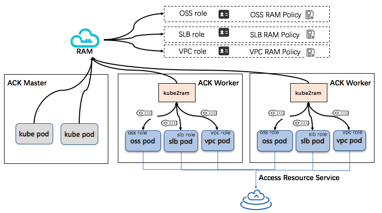

# kube2ram

## 背景

当前在一个阿里云容器服务kubernetes集群节点上的运行时刻容器中，如果想要与阿里云其他服务的云资源交互，需要通过调用ECS metadata API来获取一个临时安全令牌用于和其他服务接口的调用。

而在通常的多租场景下，不同用户的业务容器往往共享部署在同一个worker节点，由于ECS节点的instance profile只绑定了一个通用的worker节点RAM角色，因此不同用户的业务容器只能共享使用同一个角色返回的临时安全令牌，在多租场景下这样的安全隔离性是不能被接受的。

kube2ram正是基于此问题提出的解决方案，它可以以daemonset的形式部署在集群每一个worker节点上，通过配置iptables nat规则的方式，将容器内访问ECS metadata server获取角色名称和临时安全令牌等接口的流量转至kube2ram实例中，同时其他接口的访问仍会被代理到原ECS metadata server中。

<br/> 


## 配置

### RAM roles

通过调用metadata server的接口http://100.100.100.200/latest/meta-data/ram/security-credentials/ 获取worker节点（ECS实例）上绑定的RAM角色名称（以KubernetesWorkerRole-开头）。进入RAM控制台->RAM角色管理页面，寻找KubernetesWorkerRole ID对应的角色后进入权限策略管理页面，在策略内容tab中添加新的授权语句（这个例子中是许可使用KubernetesWorkerRole去Assume任何其它的RAM角色，您也可以在Resource中设置某一个或多个RAM角色的Arn来进行细粒度控制）：
```json
{
  "Version": "1",
  "Statement": [
    ...//此处省略已经授予的权限
    {
      "Action": [
        "sts:AssumeRole"
      ],
      "Effect": "Allow",
      "Resource": "*"
    }
  ]
}
```
其中`acs:ram::xxxxxxx:root`中需要填写主账号uid

同时找到需要assume的RAM角色，确认角色的可信主体策略中包含了KubernetesWorkerRole所在的账号主体：
```json
{
    "Statement": [
        {
            "Action": "sts:AssumeRole",
            "Effect": "Allow",
            "Principal": {
                "RAM": [
                    "acs:ram::xxxxxxx:root"
                ]
            }
        }
    ],
    "Version": "1"
}
```
其中xxxxxxx需要修改为Kubernetes Worker所属的主账号id。

### kube2ram daemonset

使用如下模板部署kube2ram对应daemonset，注意在kube2ram实例启动之前就运行存在的pod由于没有添加相应的iptables规则，将无法使用kube2ram相关功能。

```yaml
apiVersion: apps/v1
kind: DaemonSet
metadata:
  labels:
    app.kubernetes.io/name: kube2ram
  name: kube2ram
  namespace: kube-system
spec:
  selector:
   matchLabels:
    app.kubernetes.io/name: kube2ram
  template:
    metadata:
      labels:
        app.kubernetes.io/name: kube2ram
    spec:
      containers:
      - name: kube2ram
        image: registry.cn-hangzhou.aliyuncs.com/acs/kube2ram:1.0.0
        imagePullPolicy: Always
        args:
          - "--app-port=8181"
          - "--iptables=true"
          - "--host-ip=$(HOST_IP)"
          - "--host-interface=cni0"
          - "--verbose"
          - "--auto-discover-default-role"
        env:
        - name: HOST_IP
          valueFrom:
            fieldRef:
              apiVersion: v1
              fieldPath: status.podIP
        - name: NODE_NAME
          valueFrom:
            fieldRef:
              fieldPath: spec.nodeName
        ports:
        - containerPort: 8181
          protocol: TCP
        securityContext:
          privileged: true
      hostNetwork: true
      serviceAccountName: kube2ram
```

### iptables

为了阻止业务容器对ECS metadata server的直接访问，可以通过如下iptables示例，通过kube2ram代理业务容器对`100.100.100.200`的访问。

```bash
iptables \
  --append PREROUTING \
  --protocol tcp \
  --destination 100.100.100.200 \
  --dport 80 \
  --in-interface docker0 \
  --jump DNAT \
  --table nat \
  --to-destination `http://100.100.100.200/latest/meta-data/private-ipv4`:8181
```

通过在kube2ram启动参数中指定`--iptables=true`和环境变量`HOST_IP`，并且在security context中开启privileged特权模式，上述规则会被自动加入到路由表中。

**注意**: 如果您使用`--iptables=true`参数开启自动配置iptables规则模式，在kube2ram实例启动前就已运行的pods中的容器存在直接访问真实ECS metadata API的可能，**此时该容器可以直接assume原ECS绑定的KubernetesWorker角色，获得其所有资源访问权限，甚至可以assume到该ECS默认系统角色允许扮演的所有其他角色**。因此如果您的集群中存在非受信用户或者有pod可以创建其他pod（比如  controllers / operators）时，请谨慎使用`--iptables=true`模式或在kubelet启动前配置好相应的iptables规则。

另外规则中的`--in-interface`是通过kube2ram启动参数中的`--host-interface`指定的，该配置需要根据不同的网络插件取值：

* flannel use `cni0`
* [Terway](https://github.com/AliyunContainerService/terway) or Calico,use `cali+` (如：cali1234567890)
* kops (on kubenet), use `cbr0`
* CNI, use `cni0`
* weave use `weave`
* [kube-router](https://github.com/cloudnativelabs/kube-router) use `kube-bridge`
* [OpenShift](https://www.openshift.org/) use `tun0`
* [Cilium](https://www.cilium.io) use `lxc+`

### kubernetes annotation

通过在pod metadata中添加名称为`ram.aliyun.com/role`的annotation标签指定在pod业务容器中希望扮演的RAM角色

```yaml
apiVersion: apps/v1
kind: Deployment
metadata:
  name: nginx-deployment
  labels:
    app: nginx
spec:
  replicas: 3
  selector:
    matchLabels:
      app: nginx
  template:
    metadata:
      annotations:
        ram.aliyuncs.com/role: kube2ram-arn
      labels:
        app: nginx
    spec:
      containers:
      - name: nginx
        image: nginx:1.9.1
        ports:
        - containerPort: 80
```

可以通过参数 `--default-role`指定默认的扮演角色，当pod中没有annotation配置时，会使用该参数指定角色。

annotation在其他部署形态中，如`CronJob`:

```yaml
apiVersion: batch/v1
kind: CronJob
metadata:
  name: my-cronjob
spec:
  schedule: "00 11 * * 2"
  concurrencyPolicy: Forbid
  startingDeadlineSeconds: 3600
  jobTemplate:
    spec:
      template:
        metadata:
          annotations:
            ram.aliyuncs.com/role: kube2ram-arn
        spec:
          restartPolicy: OnFailure
          containers:
          - name: job
            image: my-image
```

### Namespace 限定

通过参数 --namespace-restrictions 可以开启角色的命名空间限定匹配模式，该模式下容器扮演的角色只能在pod所在namespace的annotation中指定允许的扮演范围中，否则扮演将被禁止。
namespace的指定扮演角色范围定义示例如下：

```yaml
apiVersion: v1
kind: Namespace
metadata:
  annotations:
    ram.aliyuncs.com/allowed-roles: |
      ["role-arn"]
  name: default
```

_注:_ 如果namespace允许扮演以指定路径开头的所有角色，可以如下定义：

```yaml
apiVersion: v1
kind: Namespace
metadata:
  annotations:
    ram.aliyuncs.com/allowed-roles: |
      ["my-custom-path/*"]
  name: default
```

如果你想以正则表达式匹配指定namespace下的允许角色，可以通过设置参数 `--namespace-restriction-format=regexp`实现:

```yaml
apiVersion: v1
kind: Namespace
metadata:
  annotations:
    ram.aliyuncs.com/allowed-roles: |
      ["my-custom-path/.*"]
  name: default
```

### RBAC配置

在开启了RBAC的集群中，需要创建以下最小化配置支持kube2ram的运行

```yaml
---
apiVersion: v1
kind: ServiceAccount
metadata:
  name: kube2ram
  namespace: kube-system
```

```yaml
---
apiVersion: v1
items:
  - apiVersion: rbac.authorization.k8s.io/v1
    kind: ClusterRole
    metadata:
      name: kube2ram
    rules:
      - apiGroups: [""]
        resources: ["namespaces","pods"]
        verbs: ["get","watch","list"]
  - apiVersion: rbac.authorization.k8s.io/v1
    kind: ClusterRoleBinding
    metadata:
      name: kube2ram
    subjects:
    - kind: ServiceAccount
      name: kube2ram
      namespace: kube-system
    roleRef:
      kind: ClusterRole
      name: kube2ram
      apiGroup: rbac.authorization.k8s.io
kind: List
```

### Debug

通过 --debug 参数可以开启调式模式获取更多的调式信息：

* `/debug/store` 通过调用该路由可以获取当前namespace和角色的映射关系

### 自动发现base-arn

通过使用参数`--auto-discover-base-arn`，kube2ram会调用ECS metadata接口自动发现默认的基础角色arn

### 使用worker节点角色作为默认的扮演角色

通过使用参数`--auto-discover-default-role`，kube2ram会自动发现绑定在ECS实例上的集群worker角色作为默认的扮演角色，当在pod annotation中无法找到指定扮演角色且默认角色在允许范围内会默认使用该角色进行扮演。

### 启动参数


```bash
$ kube2ram --help
Usage of kube2ram:
      --api-server string                     Endpoint for the api server
      --api-token string                      Token to authenticate with the api server
      --app-port string                       Kube2iam server http port (default "8181")
      --auto-discover-base-arn                Queries ECS Metadata to determine the base ARN
      --auto-discover-default-role            Queries ECS Metadata to determine the default RAM Role and base ARN, cannot be used with --default-role, overwrites any previous setting for --base-role-arn
      --backoff-max-elapsed-time duration     Max elapsed time for backoff when querying for role. (default 2s)
      --backoff-max-interval duration         Max interval for backoff when querying for role. (default 1s)
      --base-role-arn string                  Base role ARN
      --ram-role-session-ttl                  Length of session when assuming the roles (default 15m)
      --debug                                 Enable debug features
      --default-role string                   Fallback role to use when annotation is not set
      --host-interface string                 Host interface for proxying ECS metadata (default "docker0")
      --host-ip string                        IP address of host
      --ram-role-key string                   Pod annotation key used to retrieve the RAM role (default "ram.aliyuncs.com/role")
      --iptables                              Add iptables rule (also requires --host-ip)
      --log-format string                     Log format (text/json) (default "text")
      --log-level string                      Log level (default "info")
      --metadata-addr string                  Address for the ECS metadata (default "100.100.100.200")
      --metrics-port string                   Metrics server http port (default: same as kube2ram server port) (default "8181")
      --namespace-key string                  Namespace annotation key used to retrieve the RAM roles allowed (value in annotation should be json array) (default "ram.aliyuncs.com/allowed-roles")
      --namespace-restriction-format string   Namespace Restriction Format (glob/regexp) (default "glob")
      --namespace-restrictions                Enable namespace restrictions
      --node string                           Name of the node where kube2ram is running
      --verbose                               Verbose
      --version                               Print the version and exits
```